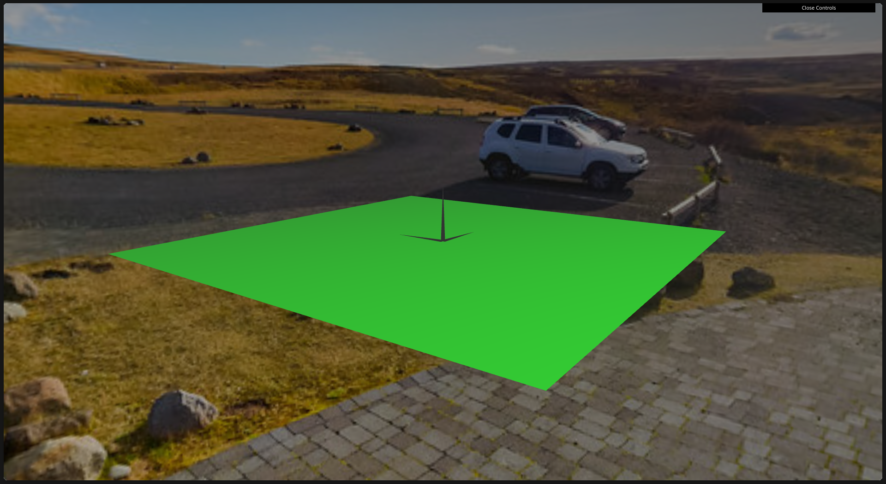
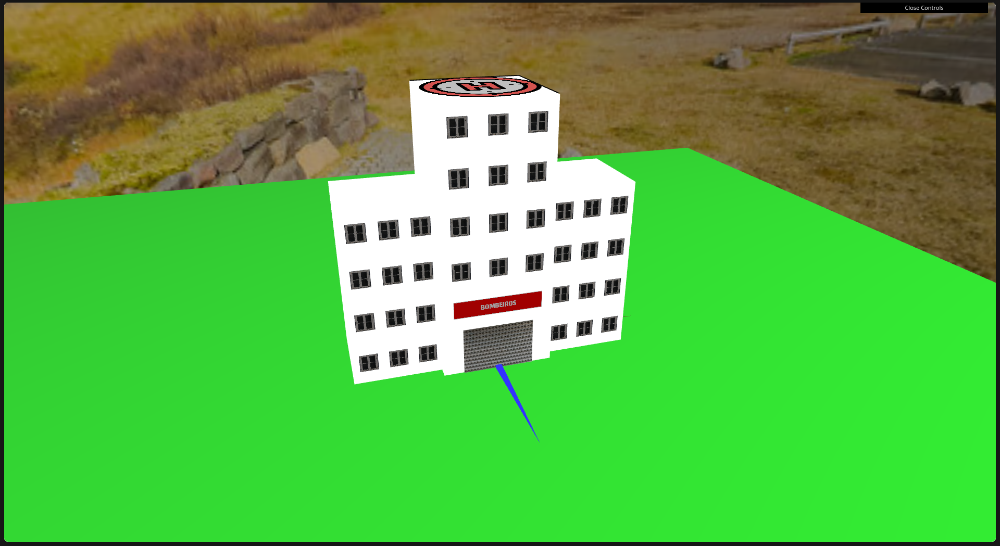

# CG 2024/2025

## Group T02G09
### Clara Sousa - 202207582
### João Mendes - 202208586
### T02 - G09

## Project Notes

### Tag 1

Sphere works and the provided texture is applied.

### Tag 2

Panorama class is working, camera is centered to the position.

### Tag 3

`MyBuilding(scene, texturesOrColor, quadMaterial, numFloors = 2, windowsPerFloor = 3)`

texturesOrColor is an argument that supports either textures or a solid color for the building's walls:

- If you want textures for the building walls, then you must pass an array of 6 CGFtexture objects.

- If you desire a solid color, then you must pass a RGBA color, as an array, for example, for white: [255, 255, 255, 1]

- Different colors can also be defined for each face of the building's modules. To do so, you must pass an array of 6 RGBA colors.

